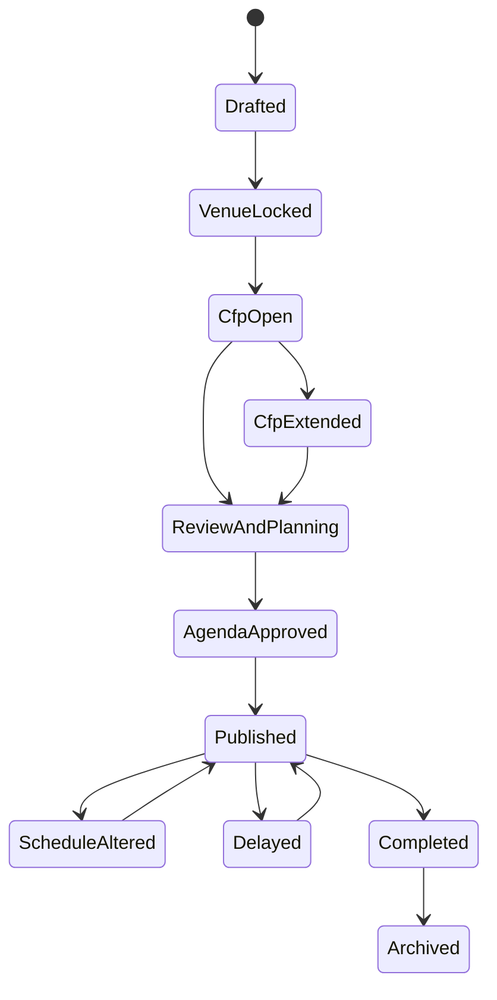
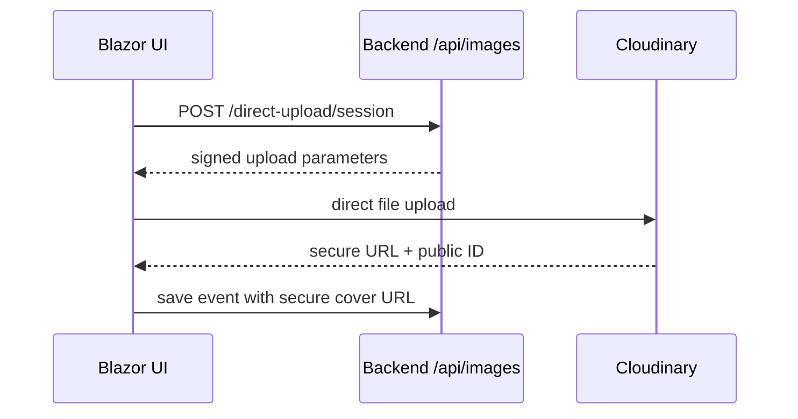

# **🏛️ Bethuya — The Agentic Community Event Intelligence Platform**

> *HackerspaceMumbai • Debuting at GitHub Copilot Dev Days • Maintained for the Community*

**Bethuya** is an **AI‑augmented, Agent-first, .NET-built,  Aspire–orchestrated** platform for planning, curating, running, and reporting community events.

> **Principle:** AI **drafts**, humans **approve**, community **owns**.
> **Reality:** Demo‑ready today, **backbone of HackerspaceMumbai** tomorrow.

***

## ✨ What Bethuya Does

* **Plan** — create draft events with organizer-configurable fairness targets, optional cover images, and *Planner Agent* agenda drafts.
* **Manage lifecycle** — move events from draft through CFP, review, agenda approval, publishing, schedule changes, completion, and archival.
* **Ingest & publish sessions** — preview/import Sessionize sessions, normalize speaker metadata, and publish deterministic GitHub event artifacts.
* **Curate (Attendees)** — *Curator Agent* helps select attendees fairly when registrations exceed capacity (often **3×**), balancing **theme suitability** and **DEI**; outputs are explainable **recommendations**, never auto‑rejections.
* **Run** — *Facilitator Agent* suggests prompts, Q\&A, and captures notes (organizer‑controlled).
* **Report** — *Reporter Agent* drafts summaries, highlights, and action items.
* **Approve** — **Human‑in‑the‑loop** diffs, approvals, and a full audit trail.

***

## 🚀 Critical "Hero" Launch Stack

### ⚡ .NET Aspire 13 (Stability Hero)

Bethuya utilizes **file-based orchestration** (`AddExecutable`) to demonstrate maximum decoupling between the API, Web, and Data layers. This ensures local-to-cloud parity as we push to Azure Container Apps.

### 📜 Scalar & Refit (Contract Hero)

* **Scalar:** The "Ground Truth" for all API definitions, integrated directly into the Aspire Dashboard.
* **Refit:** Every internal call between the Blazor Hybrid frontend and the Minimal API is strictly type-safe via Refit interfaces.

### 🛡️ Vogen & Performance (Reliability Hero)

* **Vogen:** "Zero-Gaps" identity handling. Every `AttendeeId` and `EventId` is a Vogen value object to ensure **0 B allocation** on the registration hot path.
* **Targets:** p99 latency **< 180ms** at 2,500 RPS.

### 🤖 Microsoft Foundry & Agent Framework

* **Foundry Local:** All registrant PII remains on-device for secure pre-processing before curation.
* **Microsoft Agent Framework:** Orchestrates the **@curator** and **@planner** agents for the April 18 debut.

***

## 🧱 Technology Stack

* **.NET 10** + **C# 14**
* **.NET Aspire** - orchestration, composition, service discovery, config/secrets, and the **Aspire Dashboard** for logs, traces, and health. [\[learn.microsoft.com\]](https://learn.microsoft.com/en-us/dotnet/aspire/), [\[aspire.dev\]](https://aspire.dev/dashboard/explore/)
* **Blazor Hybrid (.NET MAUI)** - one UI targeting Android, iOS, macOS, Windows via WebView; can also share UI with Blazor Web App. [\[learn.microsoft.com\]](https://learn.microsoft.com/en-us/aspnet/core/blazor/hybrid/tutorials/maui-blazor-web-app?view=aspnetcore-10.0), [\[learn.microsoft.com\]](https://learn.microsoft
* **API Documentation:** **Scalar** - integration for all endpoints..com/en-us/aspnet/core/blazor/hybrid/tutorials/maui?view=aspnetcore-10.0)
* **Blazor Blueprint UI** — modern, accessible Blazor component library with pre-built styles, headless primitives, and shadcn/ui theme compatibility. No Tailwind or Node.js required. [\[blazorblueprintui.com\]](https://blazorblueprintui.com/)
* **AI Providers (routed)** - **Foundry Local** (sensitive/offline), **Ollama** (local), **Azure OpenAI** / **OpenAI** (non‑sensitive/public). Foundry Local provides an OpenAI‑compatible local runtime on Windows/macOS. [\[devblogs.m...rosoft.com\]](https://devblogs.microsoft.com/foundry/unlock-instant-on-device-ai-with-foundry-local/), [\[github.com\]](https://github.com/microsoft/Foundry-Local)
* **Agents** - **Microsoft Agent Framework** for tool‑calling, memory, and multi‑agent workflows; works with .NET and Python. [\[learn.microsoft.com\]](https://learn.microsoft.com/en-us/agent-framework/), [\[github.com\]](https://github.com/microsoft/agent-framework)
* **Dev AI** - **GitHub Copilot SDK** (repo‑aware skills & sessions), **Copilot CLI** (agentic terminal workflows; GA), **VS Code Insiders**. [\[github.com\]](https://github.com/github/copilot-sdk/blob/main/docs/guides/skills.md), [\[github.blog\]](https://github.blog/changelog/2026-02-25-github-copilot-cli-is-now-generally-available/)
* **Testing** - **TUnit** for unit/integration tests and **Playwright for .NET** for E2E tests (Chromium/WebKit/Firefox) with tracing. [\[TUnit\]](https://github.com/tunit-framework/TUnit) [\[playwright.dev\]](https://playwright.dev/dotnet/docs/intro)

***

## 🎨 Frontend Architecture — **Blazor Hybrid + Blazor Blueprint UI**

* **Blazor Blueprint UI** provides 80+ accessible, pre-styled components and 17 headless primitives for Blazor. No Tailwind, DaisyUI, or Node.js required.
* **Theme compatibility:** Use any [shadcn/ui](https://ui.shadcn.com/themes) or [tweakcn.com](https://tweakcn.com/) theme by copying CSS variables into your `theme.css`.
* **Dark mode:** Built-in, just add `.dark` to `<html>`.
* **Setup:**

```bash
# Add Blazor Blueprint UI to your project
dotnet add package BlazorBlueprint.Components
# Optionally add icon libraries
dotnet add package BlazorBlueprint.Icons.Lucide
```

**Minimal setup:**

1. Register services in `Program.cs`:

  ```csharp
  builder.Services.AddBlazorBlueprintComponents();
  ```

2. Add to `_Imports.razor`:

  ```razor
  @using BlazorBlueprint.Components
  ```

3. Reference styles in your host page (e.g., `wwwroot/index.html`):

  ```html
  <!-- Optional: your theme variables -->
  <link rel="stylesheet" href="styles/theme.css" />
  <!-- Blazor Blueprint styles -->
  <link rel="stylesheet" href="_content/BlazorBlueprint.Components/blazorblueprint.css" />
  ```

4. Add `<BbPortalHost />` to your root layout for overlays:

  ```razor
  <BbPortalHost />
  ```

5. Use components:

  ```razor
  <BbButton Variant="ButtonVariant.Default">Click me</BbButton>
  ```

See [blazorblueprintui.com](https://blazorblueprintui.com/) for full docs and component gallery.

> **Testing tip:** Prefer `data-test` selectors in Razor components to make Playwright tests resilient to class changes. [\[playwright.dev\]](https://playwright.dev/dotnet/docs/intro)

***

### 🌟 Hackathon "Hero" Technology Implementation

#### Microsoft Foundry & Foundry Local (The Privacy Hero)

* Foundry Local: Processes sensitive PII (registrant bios/profiles) locally to ensure DPDP compliance.

* Azure AI Foundry: Manages high-reasoning agent lifecycles and global orchestration via the azure-ai-projects SDK.

#### Microsoft Agent Framework (Orchestration Hero)

Implements specialized agents like @curator with persistent memory and hosted tools.

#### NET Aspire 10 (Platform Hero)

Acts as the connective tissue for local orchestration (Azure SQL, Redis) and cloud deployment.

#### GitHub Copilot & agents.md (DX Hero)

Custom agent personas in .github/agents/ enforce coding standards and project context.

#### Blazor Blueprint UI

Accessible, headless primitives for a high-performance shadcn/ui inspired frontend.

## 📊 Performance & Verification

| Metric | Target | Verification Tool |
| :--- | :--- | :--- |
| **Hot Path Latency (p99)** | < 180ms @ 2,500 RPS | []NBomber / TUnit |
| **Memory Allocation** | 0 B on Hot Path | []BenchmarkDotNet |
| **Visual Accuracy** | 100% Match | []Playwright Visual Regression|

## 🔄 Development Protocol

- **Plan First**: All tasks must be planned in `tasks/todo.md` before execution.
* **No Laziness**: Identify root causes; no temporary hacks[cite: 888].
* **Autonomous Fixes**: Agents are authorized to resolve failing tests/CI without manual intervention.

## 📁 Repository Structure (Aspire + Frontend + Dev‑AI)

    / (root)
    ├─ Bethuya.slnx
    ├─ Directory.Build.props
    ├─ Directory.Packages.props              # Central Package Management (all versions here)
    ├─ README.md
    │
    ├─ AppHost/AppHost/                      # .NET Aspire AppHost (SQL, Keycloak, Backend, Web)
    ├─ ServiceDefaults/                      # Aspire shared: resilience, service discovery, OpenTelemetry
    │  └─ Auth/                             # Auth extensions, options, provider routing
    │
    ├─ src/
    │  ├─ Bethuya.Hybrid/                   # Blazor Hybrid + Web umbrella
    │  │   ├─ Bethuya.Hybrid/              # .NET MAUI Blazor Hybrid (Android/iOS/macOS/Windows)
    │  │   ├─ Bethuya.Hybrid.Web/          # Blazor Web App (SSR + WASM host)
    │  │   │   └─ Auth/                    # DevelopmentAuthStateProvider, ClaimsCurrentUserService
    │  │   ├─ Bethuya.Hybrid.Web.Client/   # Blazor WebAssembly client
    │  │   └─ Bethuya.Hybrid.Shared/       # Shared Razor components, Auth (roles, policies, UserInfo)
    │  ├─ Hackmum.Bethuya.Core/             # Domain: Events, Registrations, Decisions, FairnessBudget
    │  ├─ Hackmum.Bethuya.Agents/           # Planner, Curator, Facilitator, Reporter agents
    │  ├─ Hackmum.Bethuya.AI/               # Provider router (Foundry/Ollama/Azure/OpenAI), prompts, memory
    │  ├─ Hackmum.Bethuya.Backend/          # Minimal API (Aspire-connected, Refit-ready)
    │  └─ Hackmum.Bethuya.Infrastructure/   # Storage (Azure SQL), repos, platform adapters
    │
    ├─ tests/
    │  ├─ Hackmum.Bethuya.Tests/            # TUnit unit & integration tests (TDD-first)
    │  ├─ Hackmum.Bethuya.E2E/              # Playwright .NET E2E (Chromium/WebKit/Firefox + traces)
    │  └─ Bethuya.Benchmarks/               # BenchmarkDotNet micro-benchmarks
    │
    ├─ copilot/
    │  └─ skills/                           # GitHub Copilot SDK skills (repo-aware)
    │
    └─ tasks/
       ├─ todo.md                           # Plan-first task tracker
       └─ lessons.md                        # Self-correction log

***

## 🧠 Agents (Human‑in‑the‑Loop Contracts)

### Planner Agent — Agenda Drafting

Inputs: prior events, interests, constraints → **draft agenda** (sessions, timings, suggested speakers).\
**UX:** Approve / Edit / Reject (diffs + audit).

### **Curator Agent — Responsible Attendee Curation (Oversubscription)**

We frequently see **3× registrations** vs capacity. The agent assists humans to build an **open, diverse, inclusive, equitable, and theme‑aligned** attendee list.

* **Provides:** theme alignment signals (self‑reported data), community continuity, **DEI nudges** (consented fields only), equity prompts, first‑come signals (when applicable), over‑representation alerts.
* **Never:** auto‑accepts/rejects, infers sensitive traits, hides reasoning, uses opaque scoring.
* **Outputs:** **AttendanceProposal**, **WaitlistProposal**, **CurationInsights**, **FairnessBudget** targets → humans decide.
* **Fairness dimensions:** geo diversity (bucketed), Marathi/Konkani language diversity, education diversity, and optional socioeconomic diversity.
* **Target scope:** fairness targets are organizer-configurable per event, with defaults and per-event overrides.

### Facilitator Agent — Live Assistance (Opt‑in)

Prompts, Q\&A suggestions, live notes (organizer‑controlled publish).

### Reporter Agent — Post‑Event Drafting

Summary, highlights, action items → human edits → publish (attribution).

> **Agent runtime & tools:** implemented using **Microsoft Agent Framework** for tool‑calling, memory, and multi‑agent workflows in .NET. [\[learn.microsoft.com\]](https://learn.microsoft.com/en-us/agent-framework/), [\[github.com\]](https://github.com/microsoft/agent-framework)

***

## 🧩 Architecture with **.NET Aspire**

**Aspire AppHost** composes the distributed app for local development with one command, wiring up services, storage, and the **Aspire Dashboard** for observability (logs, traces, health). [\[learn.microsoft.com\]](https://learn.microsoft.com/en-us/dotnet/aspire/), [\[aspire.dev\]](https://aspire.dev/dashboard/explore/)

``` folder structure
    AppHost
      ├─ Backend API (Hackmum.Bethuya.Backend)
      ├─ Agent Workers
      │    ├─ PlannerWorker
      │    ├─ CuratorWorker
      │    └─ ReporterWorker
      ├─ Storage
      │    └─ Azure SQL
      ├─ Queue (optional) for async agent jobs
      └─ Observability (Aspire Dashboard)
```

***

## 📅 Event Management Lifecycle

Bethuya's event model now acts as the operational source of truth, not just a creation form. Organizers can save lightweight drafts, publish-ready events, and lifecycle transitions through the Backend API and Blazor UI.

### Lifecycle states



### Organizer workflow

1. **Save Draft** on `/events/plan` requires only a title and keeps the event in `Drafted`.
2. **Publish Event** validates title, dates, capacity, location-ready metadata, cover URL status, and fairness targets before creating the event.
3. **Sessionize preview/import** reads `SessionizeEventId`, fetches Sessionize sessions and speakers, normalizes them into agenda sessions, and imports idempotently.
4. **GitHub publish** writes deterministic event artifacts for the configured repository and records `GitHubFolderUrl`.
5. **Schedule alterations** require a reason, republish artifacts, and preserve the event lifecycle history.
6. **Completion/archive** marks session assets as pending after completion and blocks archival while required assets are missing unless an organizer explicitly overrides.

### Cover image uploads

Cover images use browser-direct Cloudinary uploads with a short-lived backend-signed session:



- Cloudinary settings are optional for local no-cover event saves.
- If Cloudinary is missing and an organizer tries to upload a cover image, the backend returns `503 Image uploads are unavailable` and the UI shows: "Cover image uploads are unavailable. Ask an organizer to configure Cloudinary before uploading images."
- Upload-session and pending-delete calls use a dedicated non-retrying typed client so unsafe POST failures are surfaced promptly instead of repeated.
- Saved cover URLs must be absolute HTTP/HTTPS URLs and must either match an existing persisted URL or a pending direct upload verified by the backend.

***

## Domain Modeling Principles

### Strong Domain Primitives (No Primitives in Core Domain)

Bethuya uses **Vogen** to generate strong Value Objects for all core domain concepts
(e.g., EventId, AttendeeId, EmailAddress).

❌ No raw `string`, `int`, or `Guid` in core domain models  
✅ All identifiers and value concepts MUST be explicit value objects

This ensures correctness, explainability, and safety in an agent-first system.

## 🔌 Provider Routing (Privacy‑aware)

We route AI calls by sensitivity:

1. **Foundry Local** — default for attendee curation/sensitive data (on‑device, OpenAI‑compatible API; Windows/macOS). [\[devblogs.m...rosoft.com\]](https://devblogs.microsoft.com/foundry/unlock-instant-on-device-ai-with-foundry-local/), [\[github.com\]](https://github.com/microsoft/Foundry-Local)
2. **Ollama** — local LLMs.
3. **Microsoft Foundry** — enterprise boundary for non‑sensitive/public drafts.

> **Foundry Local** chooses optimized model variants for your hardware and runs fully offline once models are cached. [\[github.com\]](https://github.com/microsoft/Foundry-Local), [\[clemenssiebler.com\]](https://clemenssiebler.com/posts/running-slm-locally-azure-foundry-local/)

***

## 🔐 Authentication

Bethuya uses a **provider-pluggable** authentication system controlled by a single config key:

```jsonc
// appsettings.json (structure only — never store secrets here)
"Authentication": {
  "Provider": "None"   // None | Entra | Auth0 | Keycloak
}
```

### Dev Mode (`Provider = "None"` — default)

When `Provider` is `"None"`, a `DevelopmentAuthenticationStateProvider` auto-authenticates every request as a **dev admin user** with all roles (Admin, Organizer, Curator, Attendee). No login challenge, no OIDC — the dashboard just works. This is the default on `main` for local development.

### Configuring a Real Provider

Provider credentials are stored via **`dotnet user-secrets`** — never in `appsettings.json`.

#### Microsoft Entra External ID

```bash
cd src/Bethuya.Hybrid/Bethuya.Hybrid.Web
dotnet user-secrets set "Authentication:Provider" "Entra"
dotnet user-secrets set "Authentication:Entra:Instance" "https://login.microsoftonline.com/"
dotnet user-secrets set "Authentication:Entra:TenantId" "<your-tenant-id>"
dotnet user-secrets set "Authentication:Entra:ClientId" "<your-client-id>"
dotnet user-secrets set "Authentication:Entra:ClientSecret" "<your-client-secret>"
dotnet user-secrets set "Authentication:Entra:Domain" "<your-domain>.onmicrosoft.com"
```

#### Auth0

```bash
cd src/Bethuya.Hybrid/Bethuya.Hybrid.Web
dotnet user-secrets set "Authentication:Provider" "Auth0"
dotnet user-secrets set "Authentication:Auth0:Domain" "<your-tenant>.auth0.com"
dotnet user-secrets set "Authentication:Auth0:ClientId" "<your-client-id>"
dotnet user-secrets set "Authentication:Auth0:ClientSecret" "<your-client-secret>"
dotnet user-secrets set "Authentication:Auth0:Audience" "<your-api-audience>"
```

#### Keycloak (self-hosted OIDC)

```bash
cd src/Bethuya.Hybrid/Bethuya.Hybrid.Web
dotnet user-secrets set "Authentication:Provider" "Keycloak"
dotnet user-secrets set "Authentication:Keycloak:Authority" "http://localhost:8080/realms/bethuya"
dotnet user-secrets set "Authentication:Keycloak:ClientId" "bethuya-web"
dotnet user-secrets set "Authentication:Keycloak:ClientSecret" "<your-client-secret>"
```

### 🐳 Local OIDC Testing with Keycloak

The Aspire AppHost includes a **Keycloak container** — run `dotnet run --project AppHost/AppHost` and Keycloak starts alongside the app. Then:

1. Open the Keycloak admin console (check Aspire Dashboard for the URL, default port `8080`).
2. Create a realm called `bethuya`, a client called `bethuya-web` (confidential, Authorization Code flow), and assign roles matching `BethuyaRoles` (Admin, Organizer, Curator, Attendee).
3. Set user-secrets as shown above with `Provider = "Keycloak"`.

> **Tip:** Use a stable port for Keycloak (`8080`) to avoid browser cookie issues with OIDC tokens that embed the authority URL.

### Role Claim Mapping

Each provider emits roles under a different claim type — the auth system maps them automatically:

| Provider | Role Claim |
|---|---|
| Entra | `roles` |
| Auth0 | `https://bethuya.dev/roles` |
| Keycloak | `realm_access` |

### ⚠️ Render Mode Rule

> **Login, auth, PII, organizer, and agent control pages MUST use `@rendermode InteractiveServer`.**
> WASM code is client-inspectable — sensitive pages are server-side only.

***

## 🎤 Debuting at **GitHub Copilot Dev Days** — AI‑Assisted Development

Bethuya showcases state‑of‑the‑art developer AI:

* **GitHub Copilot SDK** — repo‑aware **skills** loaded into Copilot sessions (add skills under `copilot/skills/**/SKILL.md`). [\[github.com\]](https://github.com/github/copilot-sdk/blob/main/docs/guides/skills.md)
* **Agent Skills** in VS Code — portable, on‑demand capabilities that load automatically when relevant. [\[code.visua...studio.com\]](https://code.visualstudio.com/docs/copilot/customization/agent-skills), [\[github.blog\]](https://github.blog/changelog/2025-12-18-github-copilot-now-supports-agent-skills/)
* **Copilot CLI (GA)** — terminal‑native **agent** for plan/review/edit/run with parallelized sub‑agents and session memory. [\[github.blog\]](https://github.blog/changelog/2026-02-25-github-copilot-cli-is-now-generally-available/)

**Example skills** we ship:

* `/seed-db` — seed dev data via Backend API.
* `/curate-attendees` — scaffold Curator pipelines & tests.
* `/run-e2e` — run Playwright and summarize failures w/ traces.
* `/explain-diff` — PR summaries & risk callouts.
* `run-benchmarks` — Verify **0B allocation** targets via BenchmarkDotNet

> The Copilot CLI is GA and supports agentic workflows (plan/autopilot), deep repo & PR integration, and skills/MCP extensibility. [\[github.blog\]](https://github.blog/changelog/2026-02-25-github-copilot-cli-is-now-generally-available/), [\[github.com\]](https://github.com/features/copilot/cli/)

***

## 🤖 Squad — Persistent AI Agent Team

Bethuya is built **with** an AI team, not just *by* one. **Squad** is a [GitHub Copilot CLI](https://github.com/features/copilot/cli/)-powered multi-agent orchestration framework that runs a persistent team of specialized AI agents alongside every developer session.

| Agent | Role | Domain |
|---|---|---|
| **Neo** | Lead / System Architect | Aspire topology, architecture decisions, cross-agent gating |
| **Trinity** | Frontend Dev | Blazor UI, Blazor Blueprint components, render modes |
| **Tank** | Backend Dev | APIs, service wiring, data flow, dependency injection |
| **Switch** | Tester | TUnit tests, Playwright E2E, quality gates |
| **Morpheus** | Security Engineer | Auth, PII routing, render mode enforcement |
| **Scribe** | Session Logger | Decision ledger, memory, session logs (silent) |

Each agent has a **charter** (identity, authority, and hard boundaries) and a **history** (project learnings that compound across sessions). Decisions flow through a drop-box pattern into `.squad/decisions.md` — the team's shared brain.

**How it works:**
- Describe work in natural language; Squad routes it to the right agent(s), in parallel.
- Agents write code, tests, docs, and decisions — humans review and approve.
- The `routing.md` table governs who owns what. Neo gates architecture; Morpheus gates security; Tank owns the backend; Trinity owns the UI.
- **Ralph** (Work Monitor) watches the GitHub issue board and keeps the pipeline moving autonomously.

**Governance files:**
- `.github/agents/squad.agent.md` — coordinator rules, routing, reviewer gating, rejection lockout
- `.squad/agents/{name}/charter.md` — per-agent identity and authority scope
- `.squad/decisions.md` — append-only shared decision ledger
- `.squad/routing.md` — work assignment table

> Activate Squad via **Copilot CLI** — address an agent by name (e.g., *"Tank, review the endpoint wiring"*) or describe work and let the coordinator route it. Squad lives in `.squad/`.

***

## 🧪 Verification driven AI‑Assisted **TDD + Playwright** feedback Loop

* **Unit/Domain tests** (TDD first): `dotnet watch test src/Hackmum.Bethuya.Tests` (using **TUnit**). Every feature begins with a TUnit test.
* **E2E with Visual Proof**: `dotnet test tests/Hackmum.Bethuya.E2E` (Chromium/WebKit/Firefox; tracing on failures). [\[playwright.dev\]](https://playwright.dev/dotnet/docs/intro) Playwright MCP must capture screenshots of UI changes before completion.
* Use **Copilot Chat/Edits** to scaffold tests, then harden assertions manually.
* Prefer `data-test` selectors to keep tests stable with Blazor Blueprint UI. [\[playwright.dev\]](https://playwright.dev/dotnet/docs/intro)
* **Ralph Loop**: Iterative refinement of code based on automated feedback.
* **Self-Correction**: Every developer/agent mistake is recorded in tasks/lessons.md to prevent recurrence.

***

## 📊 Benchmarking & Performance

Bethuya is built for speed. We use BenchmarkDotNet and NBomber to ensure our "foundation" is rock solid.

### ⚖️ Performance Targets

* **Registration Hot Path**: p95 < 80ms at 2,500 RPS; p99 < 180ms.
* **Allocation**: Zero-allocation hot paths for ID handling and JSON serialization.
* **Cache Efficiency**: >90% L1/Redis hit rate for event metadata.
* **Memory**: Steady-state usage < 65% of allocated RAM.
* **Resilience**: Circuit breakers on all external AI services.

### Running Benchmarks

```bash
# Run micro-benchmarks
dotnet run -c Release --project tests/Bethuya.Benchmarks

# Run load tests (requires Aspire AppHost running)
pwsh ./scripts/load-test.ps1 --rps 2500
```
  
## 🚀 Getting Started

### Prerequisites

* **.NET 10 SDK**, **.NET MAUI** workload, **.NET Aspire** workload. [\[learn.microsoft.com\]](https://learn.microsoft.com/en-us/aspnet/core/blazor/hybrid/tutorials/maui?view=aspnetcore-10.0), [\[learn.microsoft.com\]](https://learn.microsoft.com/en-us/dotnet/aspire/)
* Platform tooling for your targets (Android/iOS/macOS/Windows). [\[learn.microsoft.com\]](https://learn.microsoft.com/en-us/aspnet/core/blazor/hybrid/tutorials/maui-blazor-web-app?view=aspnetcore-10.0)

### Clone & Restore

```bash
git clone https://github.com/HackerspaceMumbai/Bethuya.git
cd Bethuya
dotnet restore
```

### Configure AI Providers (privacy‑aware)

```bash
# Configure once at Aspire AppHost for local orchestration defaults
cd AppHost/AppHost
dotnet user-secrets init

# Sensitive flows local-first:
dotnet user-secrets set "Ai:Provider" "FoundryLocal"
dotnet user-secrets set "Ai:Fallback"  "Ollama"

# Cloud (non-sensitive/public drafts):
dotnet user-secrets set "AzureOpenAI:Endpoint" "<endpoint>"
dotnet user-secrets set "AzureOpenAI:ApiKey" "<key>"
dotnet user-secrets set "OpenAI:ApiKey" "<key>"
```

*(Foundry Local offers an OpenAI‑compatible API and SDKs for integration.)* [\[github.com\]](https://github.com/microsoft/Foundry-Local)

### Configure event integrations

Event creation works without these integrations, but the related buttons/endpoints become useful when configured.

```bash
# Backend project secrets
cd src/Hackmum.Bethuya.Backend

# Cloudinary cover uploads (optional locally; required for cover images)
dotnet user-secrets set "Cloudinary:CloudName" "<cloud-name>"
dotnet user-secrets set "Cloudinary:ApiKey" "<api-key>"
dotnet user-secrets set "Cloudinary:ApiSecret" "<api-secret>"
# Optional:
dotnet user-secrets set "Cloudinary:UploadPreset" "<signed-upload-preset>"

# Sessionize import
dotnet user-secrets set "Sessionize:BaseUrl" "https://sessionize.com"
dotnet user-secrets set "Sessionize:ApiToken" "<token-if-required>"

# GitHub event artifact publishing
dotnet user-secrets set "GitHubEvents:Owner" "HackerspaceMumbai"
dotnet user-secrets set "GitHubEvents:Repository" "bethuya"
dotnet user-secrets set "GitHubEvents:Branch" "main"
dotnet user-secrets set "GitHubEvents:Token" "<fine-grained-token>"
```

Do not store these values in `appsettings.json`. Hosted environments load runtime secrets from Azure Key Vault through managed identity; see `docs/security/secrets-management.md`.

```bash
aspire start --isolated
# The Aspire Dashboard opens with links to services & health.
```

[\[aspire.dev\]](https://aspire.dev/dashboard/explore/)

### Build the UI (Blazor Blueprint UI)

No build step required. Just add the NuGet package and reference the stylesheet as above.

### Run on platforms (direct)

```bash
# Windows (WinUI)
dotnet run --project src/Hackmum.Bethuya.App -f net10.0-windows10.0.19041.0

# Android
dotnet build src/Hackmum.Bethuya.App -t:Run -f net10.0-android

# iOS (on macOS)
dotnet build src/Hackmum.Bethuya.App -f net10.0-ios

# macOS (MacCatalyst)
dotnet run --project src/Hackmum.Bethuya.App -f net10.0-maccatalyst
```

[\[learn.microsoft.com\]](https://learn.microsoft.com/en-us/aspnet/core/blazor/hybrid/tutorials/maui-blazor-web-app?view=aspnetcore-10.0)

***

## ⚙️ `Directory.Build.props` (starter)

```xml
<Project>
  <PropertyGroup>
    <TargetFrameworks>
      net10.0;net10.0-android;net10.0-ios;net10.0-maccatalyst;net10.0-windows10.0.19041.0
    </TargetFrameworks>
    <Nullable>enable</Nullable>
    <ImplicitUsings>enable</ImplicitUsings>
    <LangVersion>preview</LangVersion>
    <Deterministic>true</Deterministic>
    <TreatWarningsAsErrors>false</TreatWarningsAsErrors>
  </PropertyGroup>

  <ItemGroup>
    <PackageReference Update="TUnit" Version="*" />
    <PackageReference Update="Microsoft.Playwright.NUnit" Version="*" />
    <!-- Microsoft Agent Framework / SK once pinned -->
    <!-- <PackageReference Update="Microsoft.AgentFramework" Version="*" /> -->
    <!-- <PackageReference Update="Microsoft.SemanticKernel" Version="*" /> -->
  </ItemGroup>
</Project>
```

***

## 🔐 Privacy, Safety, and DEI

* **Consent first** — only use self‑provided, consented fields for curation.
* **Derived only** — curation uses privacy-safe derived buckets/signals (geo bucket, normalized language flags, education bucket, optional socioeconomic bucket).
* **No raw sensitive display** — disability, neurodiversity, and additional support answers are never shown in curation APIs/UI.
* **No inference** of sensitive traits; no opaque scoring.
* **Explainable** suggestions; human approvals required.
* **Auditability** — logs & traces in Aspire Dashboard. [\[aspire.dev\]](https://aspire.dev/dashboard/explore/)
* **Local‑first** for sensitive flows via **Foundry Local** (offline, on‑device). [\[devblogs.m...rosoft.com\]](https://devblogs.microsoft.com/foundry/unlock-instant-on-device-ai-with-foundry-local/), [\[github.com\]](https://github.com/microsoft/Foundry-Local)

***

## 🧭 Demo Flow (Dev Days–ready)

1. **Create Event** — save a draft or publish-ready “GitHub Copilot Dev Days: Mumbai” event with fairness targets and an optional cover image.
2. **Import Sessions** — preview Sessionize content, normalize speakers/sessions, and import without duplicating existing source sessions.
3. **Planner** — review agenda proposals → approve subset → publish the planning cycle.
4. **Publish Event** — move the lifecycle to `Published`, generate GitHub event artifacts, and store the public registration/GitHub references.
5. **Curator (Attendees)** — set capacity → review **FairnessBudget** + **AttendanceProposal** → accept → **WaitlistProposal** generated.
6. **Operate** — alter schedules with an explicit reason, complete the event, collect missing session assets, then archive.
7. **Report** — reporter draft → minimal edits → publish with attribution.
8. **Dev AI** — run `/run-e2e` skill (Playwright), inspect traces; use **Copilot CLI** to `/plan` a refactor and open a PR. [\[playwright.dev\]](https://playwright.dev/dotnet/docs/intro), [\[github.blog\]](https://github.blog/changelog/2026-02-25-github-copilot-cli-is-now-generally-available/)

***

## 🧩 Curation View — Operator Workflow & UI Contracts

This section documents the current Curation Intelligence interaction model so future contributors can change it safely.

### Suggest Starting Cohort (human-in-the-loop)

1. Click **Suggest Starting Cohort** in the fairness action block.
2. Configure strategy, cohort size, and optional constraints in the modal.
3. Generate suggestions; the system marks candidates as **Suggested** (assistive only).
4. Review rationale and manually approve/waitlist/reject from the sticky action tray.
5. Use **Remove from Suggestions**, **Add to Suggestions**, or **Clear Suggestions** at any time.

> Guardrail: Suggestions are reversible and never auto-approve attendees.

### Queue behavior after generation

- Queue automatically focuses suggested registrants after generation.
- Search/status filters are reset so suggested results are not accidentally hidden.
- Suggested registrants are visually tagged in a fixed card slot to keep card dimensions stable.
- Clearing suggestions restores neutral queue behavior.

### Fairness and impact reading model

- **High Impact** chips are the primary fairness attention lane.
- **Stable** chips remain compact to reduce cognitive load.
- Impact preview shows concise gains/risks; lower-priority risk items are collapsed.
- Copy in reliability/intent sections is decision-oriented and metric-linked.

### Layout invariants (do not regress)

- Profile pane uses scrollable content with a bottom action row.
- Sticky decision/action tray must remain visible at the bottom of the detail pane.
- Modal overlays must capture interactions above queue/content layers.

### Implementation guidance

- Prefer Blazor Blueprint component composition over custom CSS.
- Keep custom CSS focused on structure/overflow/sticky constraints.
- Preserve `data-test` selectors for curation E2E and render tests.

### Primary files for curation UX work

- `src/Bethuya.Hybrid/Bethuya.Hybrid.Web/Components/Pages/CurationView.razor`
- `src/Bethuya.Hybrid/Bethuya.Hybrid.Web/Components/Pages/CurationView.razor.css`
- `tests/Hackmum.Bethuya.Tests/UI/CurationViewRenderTests.cs`

***

## 👥 Contributing (Copilot‑first, Human‑reviewed)

* Namespace: **`Hackmum.Bethuya.*`**
* Commit: `type(scope): message` (e.g., `feat(curator): fairness budget model`)
* Use **Copilot Chat/Edits** + **Copilot SDK skills** for boilerplate, tests, refactors, docs — **humans** review agent logic/prompts, DEI safeguards, and data handling. [\[github.com\]](https://github.com/github/copilot-sdk/blob/main/docs/guides/skills.md)
* Recommended VS Code Insiders extensions: Copilot (Chat/Edits), C# Dev Kit, .NET Aspire, Dev Containers, GitHub PRs. [\[learn.microsoft.com\]](https://learn.microsoft.com/en-us/dotnet/aspire/)

***

## 🛣 Roadmap

### Hackathon Scope

* [x] Event model & storage
* [x] Event lifecycle, Sessionize ingestion, GitHub artifact publishing, and cover-image upload handling
* [ ] Planner + **Curator (attendees)** agents
* [ ] Diff + approval workflow (HIL)
* [ ] Reporter draft
* [ ] Aspire AppHost + telemetry

### Post‑Hackathon (Backbone Goals)

* [ ] Speaker proposal portal & review
* [ ] Multi‑event dashboards, templates, recurrence
* [ ] Public event pages (export to Markdown/GitHub Pages)
* [ ] RSVP + QR check‑in
* [ ] Transcription & highlights
* [ ] Plugin‑style agent extensibility (via **Microsoft Agent Framework**) [\[learn.microsoft.com\]](https://learn.microsoft.com/en-us/agent-framework/)
* [ ] Offline‑first sync model
* [ ] Multi‑chapter hierarchy
* [ ] Advanced analytics & insights

***

## 📜 License

**MIT** — for maximum community adoption.

***

## 🙌 Acknowledgments

Built by and for the **HackerspaceMumbai** community.\
Powered by **.NET 10**, **.NET Aspire**, **Blazor Hybrid (MAUI)**, **Blazor Blueprint UI**, **Microsoft Agent Framework**, **Foundry Local**, and **GitHub Copilot + VS Code Insiders**. [\[learn.microsoft.com\]](https://learn.microsoft.com/en-us/dotnet/aspire/), [\[blazorblueprintui.com\]](https://blazorblueprintui.com/), [\[learn.microsoft.com\]](https://learn.microsoft.com/en-us/agent-framework/), [\[devblogs.m...rosoft.com\]](https://devblogs.microsoft.com/foundry/unlock-instant-on-device-ai-with-foundry-local/), [\[github.blog\]](https://github.blog/changelog/2026-02-25-github-copilot-cli-is-now-generally-available/)

***
