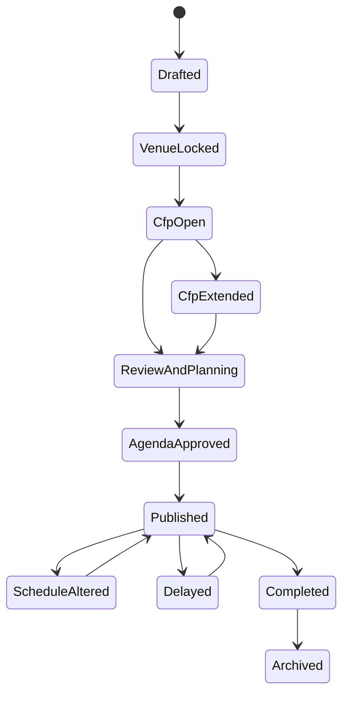
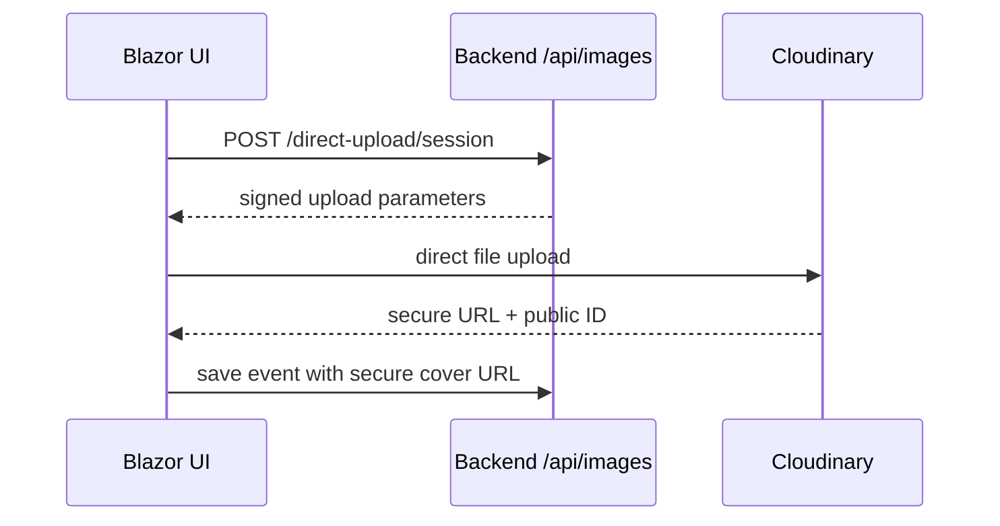

# 🏛️ Bethuya

## The Community Operating System

_Built by the community. For the community._

Bethuya is an AI-assisted Community Operating System that helps community-led organizations understand member journeys, create opportunities, develop future leaders, and measure community health over time.

Most platforms manage events.

**Bethuya helps communities grow people.**

It combines:

- Community Passport
- Community Graph
- Opportunity Engine
- Volunteer & Mentorship Networks
- Event Operations
- Community Intelligence Agents

into a single platform designed for sustainable community growth.

> AI recommends.
>
> Humans decide.
>
> Communities thrive.

***

## 🎯 Strategic Positioning

Bethuya acts as an intelligence and coordination layer sitting above existing communication platforms (Teams, Discord, Matrix) and event registration portals (Luma, Meetup, Eventbrite).

| What Bethuya IS | What Bethuya IS NOT |
| :--- | :--- |
| ✅ **Community Intelligence Platform** | ❌ Chat app (Teams / Discord replacement) |
| ✅ **Member Journey & Passport Manager** | ❌ Event ticketing/registration portal |
| ✅ **Opportunity & Fairness Engine** | ❌ CFP / Session management system |
| ✅ **Volunteer & Leadership Pipeline Manager** | ❌ Secret social-credit or ranking system |

## 🌍 Why Bethuya Exists

Communities today operate across multiple disconnected systems:

- **Communication:** Microsoft Teams, Discord, Slack, Matrix, Element
- **Registrations:** Meetup, Luma, Eventbrite
- **Speakers & CFPs:** Sessionize
- **Code & Projects:** GitHub, GitHub Discussions
- **Volunteers & Forms:** Spreadsheets, Google Forms, Microsoft Forms

These tools help run activities.

They do not help communities answer questions such as:

- Who is growing within our community?
- Who consistently contributes?
- Who keeps getting waitlisted?
- Who is ready to volunteer?
- Who could become an organizer?
- Which members are disengaging?
- Is our community becoming healthier over time?
- Are opportunities being distributed fairly?
- Where are future leaders emerging?

Bethuya exists to answer those questions.

***

## 🚀 Vision & Member Lifecycle

Communities should not be optimized for events. They should be optimized for people.

Bethuya supports member progression throughout the entire community lifecycle:

```text
                     New Member
                         │
                         ▼
                 Active Participant
                         │
                         ▼
                  Regular Attendee
                         │
                         ▼
                     Volunteer
                         │
                         ▼
                Community Champion
                         │
                         ▼
                     Organizer
                         │
                         ▼
                 Community Leader
```

## 🔭 Observability Standards (Aspire + OTEL)

- **Shared defaults first:** every service uses `builder.AddServiceDefaults()` so logs, traces, metrics, service discovery, health checks, and resilience are configured uniformly.
- **Portable export contract:** telemetry emits through OTLP (`OTEL_EXPORTER_OTLP_ENDPOINT`) and can additionally route to Azure Monitor (`APPLICATIONINSIGHTS_CONNECTION_STRING`) with no code changes.
- **Deployment correlation:** resources include `deployment.environment.name`, `service.version`, and `service.build.id` so incidents can be tied to releases quickly.
- **Trace-safe planning/agent workflows:** planner invocations propagate `traceparent` and `x-correlation-id`, persist bounded trace metadata, and tag spans with `gen_ai.*` + `mcp.*` attributes for agent/tool visibility.
- **Operational health endpoints:** all services expose `/health` + `/alive` and compatibility aliases `/healthz` + `/livez`.

See [`docs/OBSERVABILITY_FRAMEWORK.md`](docs/OBSERVABILITY_FRAMEWORK.md) for implementation details, guardrails, and rollout phases.

Success is not measured by event count alone, but also by

- members retained
- contributors developed
- volunteers nurtured
- mentors discovered
- leaders created.

## 🪪 Living Profiles & Member Passport

Every member owns a living Community Passport. It serves as the primary source of truth for understanding a person's complete community journey.

```text
+-----------------------------------------------------------------------------+
| [Avatar] Augustine Correa   [GitHub Verified] [LinkedIn Verified] (Tier)   |
+-----------------------------------------------------------------------------+
| [ Attended: 12 ]    |    [ Volunteered: 3 ]    |    [ Milestones: 4 ]       |
+-----------------------------------------------------------------------------+
| Journey Feed                                   | Privacy Controls           |
| • Attended Global Azure '26                    | [x] Visible to Organizers  |
| • Volunteered Copilot Dev Day                  | [x] Public Profile         |
+-----------------------------------------------------------------------------+
```

- Upfront Verification: Eliminates fragile identity matching by verifying GitHub and LinkedIn profiles directly during registration.  
- Auditable Participation Ledger: Keeps an auditable history of registrations, attendance, waitlists, volunteer shifts, and recognitions.  
- Symmetric Privacy Controls: Members own their data and toggle profile visibility (Public, Community-Only, Organizer-Only).

> The result is a holistic view of member engagement instead of isolated event records. Every important engagement becomes a durable signal that helps organizers understand community growth over time.

## ⚖️ Opportunity Engine & Opportunity Ladder

The Opportunity Engine is the core differentiator of Bethuya. Rather than evaluating a person in the context of a single registration, Bethuya considers their broader community journey.  

### Opportunity Engine Signal Flow

```text
                    ┌────────────────────┐
                    │  Community Member  │
                    └─────────┬──────────┘
                              │
                              ▼
         ┌───────────────────────────────────────┐
         │ Participation & Contributions         │
         ├───────────────────────────────────────┤
         │ • Events Attended                     │
         │ • Registrations                       │
         │ • Waitlist History                    │
         │ • Volunteer Activity                  │
         │ • Mentorship Activity                 │
         │ • Community Engagement                │
         │ • Technology Interests                │
         └─────────────────┬─────────────────────┘
                           │
                           ▼
              ┌──────────────────────────┐
              │     Signal Detection     │
              └──────────┬───────────────┘
     ┌───────────────────┼───────────────────┐
     ▼                   ▼                   ▼
 First-Time       Repeated Waitlist   Frequent Volunteer
     ▼                   ▼                   ▼
 Emerging        Returning Member    Community Champion
 Contributor
                         │
                         ▼
               Opportunity Engine
                         │
     ┌───────────────────┼───────────────────┐
     ▼                   ▼                   ▼
 Volunteer         Mentor            Project
 Opportunity       Opportunity       Opportunity
     ▼                   ▼                   ▼
 Speaking          Leadership        Organizer
 Pathway           Pathway           Pathway
                         │
                         ▼
                    Human Review
                         │
                         ▼
                 Community Decision
```

### 🪜 Opportunity Ladder

```text

                        Community Leader
                                ▲
                                │
                            Organizer
                                ▲
                                │
                        Community Champion
                                ▲
                                │
                              Mentor
                                ▲
                                │
                            Volunteer
                                ▲
                                │
                        Active Participant
                                ▲
                                │
                            New Member
```

- Fairness Workflows: Identifies members who are repeatedly waitlisted (registrations often exceed capacity by 3×), first-time participants, and active volunteers ready for speaking slots.
- Anonymized Selection Mode: Organizers can toggle anonymized views during attendee curation to eliminate implicit bias.

> The Opportunity Engine helps members move upward through the community over time.

## 🌐 The Community Graph

Communities are networks, not lists. Bethuya models interactions as a living graph connecting people, events, projects, technologies, contributions, mentors, and volunteers:

```text

                            ┌─────────────┐
                            │ Technology  │
                            │ AI / .NET   │
                            │ Azure / OSS │
                            └──────┬──────┘
                                   │
                        Interested In
                                   │
┌─────────────┐       ┌────────────▼────────────┐
│ Community   │──────▶│       Member           │◀─────┐
│ Chapter     │       │                        │       │
│ Mumbai      │       │     Community User     │       │
└──────┬──────┘       └──────┬──────────┬──────┘       │
       │                     │          │              │
       │                     ▼          ▼              │
       │            ┌─────────────┐ ┌─────────────┐    │
       │            │   Event     │ │ Volunteer   │    │
       │            │ Workshop    │ │ Assignment  │    │
       │            └──────┬──────┘ └──────┬──────┘    │
       │                   │               │           │
       │                   ▼               ▼           │
       │           ┌─────────────┐ ┌─────────────┐     │
       │           │ Attendance  │ │Contribution │     │
       │           │ History     │ │ History     │     │
       │           └─────────────┘ └─────────────┘     │
       │                                               │
       │                     ┌─────────────┐           │
       │                     │   Mentor    │───────────┘
       │                     └──────┬──────┘
       │                            │
       │                        Guides
       │                            │
       ▼                            ▼
┌─────────────────────────────────────────┐
│         Community Intelligence          │
├─────────────────────────────────────────┤
│ • Growth Signals                        │
│ • Opportunity Signals                   │
│ • Leadership Potential                  │
│ • Volunteer Readiness                   │
│ • Retention Risk                        │
│ • Community Health                      │
└─────────────────────────────────────────┘
```

### 🙋 Volunteer Network

Strong communities are powered by volunteers.

Bethuya helps communities:

- Discover future volunteers
- Assign responsibilities
- Track contributions
- Recognize effort
- Build leadership pipelines

Typical roles include:

- Registration
- Speaker Support
- Technical Support
- Photography
- Community Host
- Event Operations

### 🤝 Mentorship Network

Members grow faster when they learn from each other.

Bethuya supports:

- Mentor discovery
- Interest matching
- Skills matching
- Career mentorship
- Technical mentorship
- Speaker coaching
- Leadership coaching

The goal is to create sustainable knowledge transfer inside the community.

## 📅 Event Operations

**Events remain a core capability.** However, events are treated as moments within a broader community journey. Bethuya's event model now acts as the operational source of truth, not just a creation form. Organizers can save lightweight drafts, publish-ready events, and lifecycle transitions through the Backend API and Blazor UI.

Bethuya supports:

- Event planning
- Event lifecycle management
- Sessionize ingestion
- Agenda workflows
- Attendee curation
- Fairness workflows
- Publishing
- Schedule changes
- Event completion
- Reporting and summaries

### Lifecycle states


```mermaid
stateDiagram-v2
    [*] --> Drafted
    Drafted --> VenueLocked
    VenueLocked --> CfpOpen
    CfpOpen --> CfpExtended
    CfpOpen --> ReviewAndPlanning
    CfpExtended --> ReviewAndPlanning
    ReviewAndPlanning --> AgendaApproved
    AgendaApproved --> Published
    Published --> ScheduleAltered
    ScheduleAltered --> Published
    Published --> Delayed
    Delayed --> Published
    Published --> Completed
    Completed --> Archived
```

### Organizer workflow

1. **Save Draft** on `/events/plan` requires only a title and keeps the event in `Drafted`.
2. **Publish Event** validates title, dates, capacity, location-ready metadata, cover URL status, and fairness targets before creating the event.
3. **Sessionize preview/import** reads `SessionizeEventId`, fetches Sessionize sessions and speakers, normalizes them into agenda sessions, and imports idempotently.
4. **GitHub publish** writes deterministic event artifacts for the configured repository and records `GitHubFolderUrl`.
5. **Schedule alterations** require a reason, republish artifacts, and preserve the event lifecycle history.
6. **Completion/archive** marks session assets as pending after completion and blocks archival while required assets are missing unless an organizer explicitly overrides.

### Cover image uploads

Cover images use browser-direct Cloudinary uploads with a short-lived backend-signed session:


```mermaid
sequenceDiagram
    participant UI as Blazor UI
    participant API as Backend /api/images
    participant C as Cloudinary
    UI->>API: POST /direct-upload/session
    API-->>UI: signed upload parameters
    UI->>C: direct file upload
    C-->>UI: secure URL + public ID
    UI->>API: save event with secure cover URL
```

- Cloudinary settings are optional for local no-cover event saves.
- If Cloudinary is missing and an organizer tries to upload a cover image, the backend returns `503 Image uploads are unavailable` and the UI shows: "Cover image uploads are unavailable. Ask an organizer to configure Cloudinary before uploading images."
- Upload-session and pending-delete calls use a dedicated non-retrying typed client so unsafe POST failures are surfaced promptly instead of repeated.
- Saved cover URLs must be absolute HTTP/HTTPS URLs and must either match an existing persisted URL or a pending direct upload verified by the backend.
  
> Events are no longer isolated records. Every event contributes signals into the Community Passport, and Opportunity Engine.

## 🎯 Responsible Opportunity & Attendee Curation

Community events often experience significant oversubscription.

Bethuya assists organizers by providing:

- Theme alignment signals
- Community continuity indicators
- Opportunity signals
- Waitlist insights
- Fairness recommendations
- Participation history
- Explainable rationale

Bethuya never:

- Automatically accepts attendees
- Automatically rejects attendees
- Uses hidden scoring systems
- Makes decisions without human review

Every recommendation remains explainable and auditable.

## 🤖 Community Intelligence Agents

Bethuya uses specialized agents to assist organizers.

### Planner Agent

Drafts agendas, sessions, schedules, and planning suggestions.

### Curator Agent

Provides attendee and opportunity recommendations.

### Facilitator Agent

Assists with live event operations, prompts, and notes.

### Reporter Agent

Creates summaries, highlights, and action items.

### Community Intelligence Agent

Analyzes:

- Community growth
- Retention
- Leadership development
- Volunteer readiness
- Opportunity distribution
- Community health

## 📈 Community Health Intelligence

Measure what actually matters.

### Growth

- New Members
- Returning Members
- Growth Rate

### Retention

- 30-Day Retention
- 90-Day Retention
- Annual Retention

### Engagement

- Attendance Rates
- Volunteer Participation
- Repeat Participation

### Leadership

- New Volunteers
- New Mentors
- New Organizers
- Leadership Growth

### Opportunity Distribution

- First-Time Participation
- Waitlist Impact
- Opportunity Allocation
- Participation Equity

## 🔍 Decision Ledger

Every recommendation is:

- Explainable
- Auditable
- Reviewable
- Human-approved

Every decision records:

- Recommendation
- Supporting evidence
- Reviewer
- Outcome
- Timestamp

Communities should be able to understand how decisions were made.

## 🧠 Human-First AI Principles

Bethuya follows a simple principle:

> AI recommends.
>
> Humans decide.

AI never:

- Approves attendees automatically
- Rejects attendees automatically
- Creates hidden reputation scores
- Makes autonomous community decisions

Humans always remain accountable.

## 🔐 Privacy, Safety & Inclusion

Privacy and trust are foundational.

Principles:

- Consent-first participation
- No inference of sensitive traits
- Explainable recommendations
- Human review required
- Privacy-preserving signals
- Transparent decision-making
- Inclusive opportunity creation

The objective is equitable participation, not algorithmic control.

## 🧱 Technology Stack

- **.NET 10** + **C# 14**
- **Aspire** - orchestration, composition, service discovery, config/secrets, and the **Aspire Dashboard** for logs, traces, and health. [\[learn.microsoft.com\]](https://learn.microsoft.com/en-us/dotnet/aspire/), [\[aspire.dev\]](https://aspire.dev/dashboard/explore/)
- **Blazor Hybrid (.NET MAUI)** - one UI targeting Android, iOS, macOS, Windows via WebView; can also share UI with Blazor Web App. [\[learn.microsoft.com\]](https://learn.microsoft.com/en-us/aspnet/core/blazor/hybrid/tutorials/maui-blazor-web-app?view=aspnetcore-10.0), [\[learn.microsoft.com\]](https://learn.microsoft.com/en-us/aspnet/core/blazor/hybrid/tutorials/maui?view=aspnetcore-10.0)
- **API Documentation:** **Scalar** - integration for all endpoints..com/en-us/aspnet/core/blazor/hybrid/tutorials/maui?view=aspnetcore-10.0)
- **Blazor Blueprint UI** - modern, accessible Blazor component library with pre-built styles, headless primitives, and shadcn/ui theme compatibility. No Tailwind or Node.js required. [\[blazorblueprintui.com\]](https://blazorblueprintui.com/)
- **AI Providers (routed)** - **Foundry Local** (sensitive/offline), **Ollama** (local), **Azure OpenAI** / **OpenAI** (non‑sensitive/public). Foundry Local provides an OpenAI‑compatible local runtime on Windows/macOS. [\[devblogs.m...rosoft.com\]](https://devblogs.microsoft.com/foundry/unlock-instant-on-device-ai-with-foundry-local/), [\[github.com\]](https://github.com/microsoft/Foundry-Local)
- **Agents** - **Microsoft Agent Framework** for tool‑calling, memory, and multi‑agent workflows; works with .NET and Python. [\[learn.microsoft.com\]](https://learn.microsoft.com/en-us/agent-framework/), [\[github.com\]](https://github.com/microsoft/agent-framework)
- **Dev AI** - **GitHub Copilot SDK** (repo‑aware skills & sessions), **Copilot CLI** (agentic terminal workflows; GA), **VS Code Insiders**. [\[github.com\]](https://github.com/github/copilot-sdk/blob/main/docs/guides/skills.md), [\[github.blog\]](https://github.blog/changelog/2026-02-25-github-copilot-cli-is-now-generally-available/)
- **Testing** - **TUnit** for unit/integration tests and **Playwright for .NET** for E2E tests (Chromium/WebKit/Firefox) with tracing. [\[TUnit\]](https://github.com/tunit-framework/TUnit) [\[playwright.dev\]](https://playwright.dev/dotnet/docs/intro)

***

### 🎨 Frontend Architecture - **Blazor Hybrid + Blazor Blueprint UI**

- **Blazor Blueprint UI** provides 80+ accessible, pre-styled components and 17 headless primitives for Blazor. No Tailwind, DaisyUI, or Node.js required.
- **Theme compatibility:** Use any [shadcn/ui](https://ui.shadcn.com/themes) or [tweakcn.com](https://tweakcn.com/) theme by copying CSS variables into your `theme.css`.
- **Dark mode:** Built-in, just add `.dark` to `<html>`.
- **Setup:**

  ```bash
  # Add Blazor Blueprint UI to your project
  dotnet add package BlazorBlueprint.Components
  # Optionally add icon libraries
  dotnet add package BlazorBlueprint.Icons.Lucide
  ```

**Minimal setup:**

1. Register services in `Program.cs`:

    ```csharp
    builder.Services.AddBlazorBlueprintComponents();
    ```

2. Add to `_Imports.razor`:

    ```razor
    @using BlazorBlueprint.Components
    ```

3. Reference styles in your host page (e.g., `wwwroot/index.html`):

    ```html
    <!-- Optional: your theme variables -->
    <link rel="stylesheet" href="styles/theme.css" />
    <!-- Blazor Blueprint styles -->
    <link rel="stylesheet" href="_content/BlazorBlueprint.Components/blazorblueprint.css" />
    ```

4. Add `<BbPortalHost />` to your root layout for overlays:

    ```razor
    <BbPortalHost />
    ```

5. Use components:

    ```razor
    <BbButton Variant="ButtonVariant.Default">Click me</BbButton>
    ```

See [blazorblueprintui.com](https://blazorblueprintui.com/) for full docs and component gallery.

> **Testing tip:** Prefer `data-test` selectors in Razor components to make Playwright tests resilient to class changes. [\[playwright.dev\]](https://playwright.dev/dotnet/docs/intro)

***

## 📊 Performance & Verification

| Metric | Target | Verification Tool |
| :--- | :--- | :--- |
| **Hot Path Latency (p99)** | < 180ms @ 2,500 RPS | []NBomber / TUnit |
| **Memory Allocation** | 0 B on Hot Path | []BenchmarkDotNet |
| **Visual Accuracy** | 100% Match | []Playwright Visual Regression |

## 🔄 Development Protocol

- **Plan First**: All tasks must be planned in `tasks/todo.md` before execution.
- **No Laziness**: Identify root causes; no temporary hacks.
- **Autonomous Fixes**: Agents are authorized to resolve failing tests/CI without manual intervention.

## 📁 Repository Structure (Aspire + Frontend + Dev‑AI)

```text
    / (root)
    ├─ Bethuya.slnx
    ├─ Directory.Build.props
    ├─ Directory.Packages.props              # Central Package Management (all versions here)
    ├─ README.md
    │
    ├─ AppHost/AppHost/                      # .NET Aspire AppHost (SQL, Keycloak, Backend, Web)
    ├─ ServiceDefaults/                      # Aspire shared: resilience, service discovery, OpenTelemetry
    │  └─ Auth/                             # Auth extensions, options, provider routing
    │
    ├─ src/
    │  ├─ Bethuya.Hybrid/                   # Blazor Hybrid + Web umbrella
    │  │   ├─ Bethuya.Hybrid/              # .NET MAUI Blazor Hybrid (Android/iOS/macOS/Windows)
    │  │   ├─ Bethuya.Hybrid.Web/          # Blazor Web App (SSR + WASM host)
    │  │   │   └─ Auth/                    # DevelopmentAuthStateProvider, ClaimsCurrentUserService
    │  │   ├─ Bethuya.Hybrid.Web.Client/   # Blazor WebAssembly client
    │  │   └─ Bethuya.Hybrid.Shared/       # Shared Razor components, Auth (roles, policies, UserInfo)
    │  ├─ Hackmum.Bethuya.Core/             # Domain: Events, Registrations, Decisions, Community Passport, Mentorship
    │  ├─ Hackmum.Bethuya.Agents/           # Planner, Curator, Facilitator, Reporter agents
    │  ├─ Hackmum.Bethuya.AI/               # Provider router (Foundry/Ollama/Azure/OpenAI), prompts, memory
    │  ├─ Hackmum.Bethuya.Backend/          # Minimal API (Aspire-connected, Refit-ready)
    │  └─ Hackmum.Bethuya.Infrastructure/   # Storage (Postgres), repos, platform adapters
    │
    ├─ tests/
    │  ├─ Hackmum.Bethuya.Tests/            # TUnit unit & integration tests (TDD-first)
    │  ├─ Hackmum.Bethuya.E2E/              # Playwright .NET E2E (Chromium/WebKit/Firefox + traces)
    │  └─ Bethuya.Benchmarks/               # BenchmarkDotNet micro-benchmarks
    │
    ├─ copilot/
    │  └─ skills/                           # GitHub Copilot SDK skills (repo-aware)
    │
    └─ tasks/
       ├─ todo.md                           # Plan-first task tracker
       └─ lessons.md                        # Self-correction log

```

## 🧩 Architecture with **Aspire**

**Aspire AppHost** composes the distributed app for local development with one command, wiring up services, storage, and the **Aspire Dashboard** for observability (logs, traces, health). [\[learn.microsoft.com\]](https://learn.microsoft.com/en-us/dotnet/aspire/), [\[aspire.dev\]](https://aspire.dev/dashboard/explore/)

``` folder structure
    AppHost
      ├─ Backend API (Hackmum.Bethuya.Backend)
      ├─ Agent Workers
      │    ├─ PlannerWorker
      │    ├─ CuratorWorker
      │    └─ ReporterWorker
      ├─ Storage
      │    └─ Postgres
      ├─ Queue (optional) for async agent jobs
      └─ Observability (Aspire Dashboard)
```

## Domain Modeling Principles

### Strong Domain Primitives (No Primitives in Core Domain)

Bethuya uses **Vogen** to generate strong Value Objects for all core domain concepts
(e.g., EventId, AttendeeId, EmailAddress).

❌ No raw `string`, `int`, or `Guid` in core domain models  
✅ All identifiers and value concepts MUST be explicit value objects

This ensures correctness, explainability, and safety in an agent-first system.

## 🔌 Provider Routing (Privacy‑aware)

We route AI calls by sensitivity:

1. **Foundry Local** - default for attendee curation/sensitive data (on‑device, OpenAI‑compatible API; Windows/macOS). [\[devblogs.m...rosoft.com\]](https://devblogs.microsoft.com/foundry/unlock-instant-on-device-ai-with-foundry-local/), [\[github.com\]](https://github.com/microsoft/Foundry-Local)
2. **Ollama** - local LLMs.
3. **Microsoft Foundry** - enterprise boundary for non‑sensitive/public drafts.

> **Foundry Local** chooses optimized model variants for your hardware and runs fully offline once models are cached. [\[github.com\]](https://github.com/microsoft/Foundry-Local), [\[clemenssiebler.com\]](https://clemenssiebler.com/posts/running-slm-locally-azure-foundry-local/)

***

## 🔐 Authentication

Bethuya uses a **provider-pluggable** authentication system controlled by a single config key:

```jsonc
// appsettings.json (structure only - never store secrets here)
"Authentication": {
  "Provider": "None"   // None | Entra | Auth0 | Keycloak
}
```

### Dev Mode (`Provider = "None"` - default)

When `Provider` is `"None"`, a `DevelopmentAuthenticationStateProvider` auto-authenticates every request as a **dev admin user** with all roles (Admin, Organizer, Curator, Attendee). No login challenge, no OIDC - the dashboard just works. This is the default on `main` for local development.

### Configuring a Real Provider

Provider credentials are stored via **`dotnet user-secrets`** - never in `appsettings.json`.

#### Microsoft Entra External ID

```bash
cd src/Bethuya.Hybrid/Bethuya.Hybrid.Web
dotnet user-secrets set "Authentication:Provider" "Entra"
dotnet user-secrets set "Authentication:Entra:Instance" "https://login.microsoftonline.com/"
dotnet user-secrets set "Authentication:Entra:TenantId" "<your-tenant-id>"
dotnet user-secrets set "Authentication:Entra:ClientId" "<your-client-id>"
dotnet user-secrets set "Authentication:Entra:ClientSecret" "<your-client-secret>"
dotnet user-secrets set "Authentication:Entra:Domain" "<your-domain>.onmicrosoft.com"
```

#### Auth0

```bash
cd src/Bethuya.Hybrid/Bethuya.Hybrid.Web
dotnet user-secrets set "Authentication:Provider" "Auth0"
dotnet user-secrets set "Authentication:Auth0:Domain" "<your-tenant>.auth0.com"
dotnet user-secrets set "Authentication:Auth0:ClientId" "<your-client-id>"
dotnet user-secrets set "Authentication:Auth0:ClientSecret" "<your-client-secret>"
dotnet user-secrets set "Authentication:Auth0:Audience" "<your-api-audience>"
```

#### Keycloak (self-hosted OIDC)

```bash
cd src/Bethuya.Hybrid/Bethuya.Hybrid.Web
dotnet user-secrets set "Authentication:Provider" "Keycloak"
dotnet user-secrets set "Authentication:Keycloak:Authority" "http://localhost:8080/realms/bethuya"
dotnet user-secrets set "Authentication:Keycloak:ClientId" "bethuya-web"
dotnet user-secrets set "Authentication:Keycloak:ClientSecret" "<your-client-secret>"
```

### 🐳 Local OIDC Testing with Keycloak

The Aspire AppHost includes a **Keycloak container** - run `dotnet run --project AppHost/AppHost` and Keycloak starts alongside the app. Then:

1. Open the Keycloak admin console (check Aspire Dashboard for the URL, default port `8080`).
2. Create a realm called `bethuya`, a client called `bethuya-web` (confidential, Authorization Code flow), and assign roles matching `BethuyaRoles` (Admin, Organizer, Curator, Attendee).
3. Set user-secrets as shown above with `Provider = "Keycloak"`.

> **Tip:** Use a stable port for Keycloak (`8080`) to avoid browser cookie issues with OIDC tokens that embed the authority URL.

### Role Claim Mapping

Each provider emits roles under a different claim type - the auth system maps them automatically:

| Provider | Role Claim |
| --- | --- |
| Entra | `roles` |
| Auth0 | `https://bethuya.dev/roles` |
| Keycloak | `realm_access` |

### ⚠️ Render Mode Rule

> **Login, auth, PII, organizer, and agent control pages MUST use `@rendermode InteractiveServer`.**
> WASM code is client-inspectable - sensitive pages are server-side only.

***

### Dev AI skills

**Example skills** we ship:

- `/seed-db` - seed dev data via Backend API.
- `/curate-attendees` - scaffold Curator pipelines & tests.
- `/run-e2e` - run Playwright and summarize failures w/ traces.
- `/explain-diff` - PR summaries & risk callouts.
- `/run-benchmarks` - Verify **0B allocation** targets via BenchmarkDotNet

***

## 🤖 Squad - Persistent AI Agent Team

Bethuya is built **with** an AI team, not just _by_ one. **Squad** is a [GitHub Copilot CLI](https://github.com/features/copilot/cli/)-powered multi-agent orchestration framework that runs a persistent team of specialized AI agents alongside every developer session.

| Agent | Role | Domain |
| --- | --- | --- |
| **Neo** | Lead / System Architect | Aspire topology, architecture decisions, cross-agent gating |
| **Trinity** | Frontend Dev | Blazor UI, Blazor Blueprint components, render modes |
| **Tank** | Backend Dev | APIs, service wiring, data flow, dependency injection |
| **Switch** | Tester | TUnit tests, Playwright E2E, quality gates |
| **Morpheus** | Security Engineer | Auth, PII routing, render mode enforcement |
| **Scribe** | Session Logger | Decision ledger, memory, session logs (silent) |

Each agent has a **charter** (identity, authority, and hard boundaries) and a **history** (project learnings that compound across sessions). Decisions flow through a drop-box pattern into `.squad/decisions.md` - the team's shared brain.

**How it works:**

- Describe work in natural language; Squad routes it to the right agent(s), in parallel.
- Agents write code, tests, docs, and decisions - humans review and approve.
- The `routing.md` table governs who owns what. Neo gates architecture; Morpheus gates security; Tank owns the backend; Trinity owns the UI.
- **Ralph** (Work Monitor) watches the GitHub issue board and keeps the pipeline moving autonomously.

**Governance files:**

- `.github/agents/squad.agent.md` - coordinator rules, routing, reviewer gating, rejection lockout
- `.squad/agents/{name}/charter.md` - per-agent identity and authority scope
- `.squad/decisions.md` - append-only shared decision ledger
- `.squad/routing.md` - work assignment table

> Activate Squad via **Copilot CLI** - address an agent by name (e.g., _"Tank, review the endpoint wiring"_) or describe work and let the coordinator route it. Squad lives in `.squad/`.

***

## 🧪 Verification driven AI‑Assisted **TDD + Playwright** feedback Loop

- **Unit/Domain tests** (TDD first): `dotnet watch test src/Hackmum.Bethuya.Tests` (using **TUnit**). Every feature begins with a TUnit test.
- **E2E with Visual Proof**: `dotnet test tests/Hackmum.Bethuya.E2E` (Chromium/WebKit/Firefox; tracing on failures). [\[playwright.dev\]](https://playwright.dev/dotnet/docs/intro) Playwright MCP must capture screenshots of UI changes before completion.
- Use **Copilot Chat/Edits** to scaffold tests, then harden assertions manually.
- Prefer `data-test` selectors to keep tests stable with Blazor Blueprint UI. [\[playwright.dev\]](https://playwright.dev/dotnet/docs/intro)
- **Ralph Loop**: Iterative refinement of code based on automated feedback.
- **Self-Correction**: Every developer/agent mistake is recorded in tasks/lessons.md to prevent recurrence.

***

## 📊 Benchmarking & Performance

Bethuya is built for speed. We use BenchmarkDotNet and NBomber to ensure our "foundation" is rock solid.

### ⚖️ Performance Targets

- **Registration Hot Path**: p95 < 80ms at 2,500 RPS; p99 < 180ms.
- **Allocation**: Zero-allocation hot paths for ID handling and JSON serialization.
- **Cache Efficiency**: >90% L1/Redis hit rate for event metadata.
- **Memory**: Steady-state usage < 65% of allocated RAM.
- **Resilience**: Circuit breakers on all external AI services.

### Running Benchmarks

```bash
# Run micro-benchmarks
dotnet run -c Release --project tests/Bethuya.Benchmarks

# Run load tests (requires Aspire AppHost running)
pwsh ./scripts/load-test.ps1 --rps 2500
```
  
## 🚀 Getting Started

### Prerequisites

- **.NET 10 SDK**, **.NET MAUI** workload, **Aspire** workload. [\[learn.microsoft.com\]](https://learn.microsoft.com/en-us/aspnet/core/blazor/hybrid/tutorials/maui?view=aspnetcore-10.0), [\[learn.microsoft.com\]](https://learn.microsoft.com/en-us/dotnet/aspire/)
- Platform tooling for your targets (Android/iOS/macOS/Windows). [\[learn.microsoft.com\]](https://learn.microsoft.com/en-us/aspnet/core/blazor/hybrid/tutorials/maui-blazor-web-app?view=aspnetcore-10.0)

### Clone & Restore

```bash
git clone https://github.com/HackerspaceMumbai/Bethuya.git
cd Bethuya
dotnet restore
```

### Configure AI Providers (privacy‑aware)

```bash
# Configure once at Aspire AppHost for local orchestration defaults
cd AppHost/AppHost
dotnet user-secrets init

# Sensitive flows local-first:
dotnet user-secrets set "Ai:Provider" "FoundryLocal"
dotnet user-secrets set "Ai:Fallback"  "Ollama"

# Cloud (non-sensitive/public drafts):
dotnet user-secrets set "AzureOpenAI:Endpoint" "<endpoint>"
dotnet user-secrets set "AzureOpenAI:ApiKey" "<key>"
dotnet user-secrets set "OpenAI:ApiKey" "<key>"
```

_(Foundry Local offers an OpenAI‑compatible API and SDKs for integration.)_ [\[github.com\]](https://github.com/microsoft/Foundry-Local)

### Configure event integrations

Event creation works without these integrations, but the related buttons/endpoints become useful when configured.

```bash
# Backend project secrets
cd src/Hackmum.Bethuya.Backend

# Cloudinary cover uploads (optional locally; required for cover images)
dotnet user-secrets set "Cloudinary:CloudName" "<cloud-name>"
dotnet user-secrets set "Cloudinary:ApiKey" "<api-key>"
dotnet user-secrets set "Cloudinary:ApiSecret" "<api-secret>"
# Optional:
dotnet user-secrets set "Cloudinary:UploadPreset" "<signed-upload-preset>"

# Sessionize import
dotnet user-secrets set "Sessionize:BaseUrl" "https://sessionize.com"
dotnet user-secrets set "Sessionize:ApiToken" "<token-if-required>"

# GitHub event artifact publishing
dotnet user-secrets set "GitHubEvents:Owner" "HackerspaceMumbai"
dotnet user-secrets set "GitHubEvents:Repository" "bethuya"
dotnet user-secrets set "GitHubEvents:Branch" "main"
dotnet user-secrets set "GitHubEvents:Token" "<fine-grained-token>"
```

Do not store these values in `appsettings.json`. Hosted environments load runtime secrets from Azure Key Vault through managed identity; see `docs/security/secrets-management.md`.

```bash
aspire start --isolated
# The Aspire Dashboard opens with links to services & health.
```

[\[aspire.dev\]](https://aspire.dev/dashboard/explore/)

### Build the UI (Blazor Blueprint UI)

No build step required. Just add the NuGet package and reference the stylesheet as above.

### Run on platforms (direct)

```bash
# Windows (WinUI)
dotnet run --project src/Hackmum.Bethuya.App -f net10.0-windows10.0.19041.0

# Android
dotnet build src/Hackmum.Bethuya.App -t:Run -f net10.0-android

# iOS (on macOS)
dotnet build src/Hackmum.Bethuya.App -f net10.0-ios

# macOS (MacCatalyst)
dotnet run --project src/Hackmum.Bethuya.App -f net10.0-maccatalyst
```

[\[learn.microsoft.com\]](https://learn.microsoft.com/en-us/aspnet/core/blazor/hybrid/tutorials/maui-blazor-web-app?view=aspnetcore-10.0)

***

## 🔐 Privacy, Safety, and DEI

- **Consent first** - only use self‑provided, consented fields for curation.
- **Derived only** - curation uses privacy-safe derived buckets/signals (geo bucket, normalized language flags, education bucket, optional socioeconomic bucket).
- **No raw sensitive display** - disability, neurodiversity, and additional support answers are never shown in curation APIs/UI.
- **No inference** of sensitive traits; no opaque scoring.
- **Explainable** suggestions; human approvals required.
- **Auditability** - logs & traces in Aspire Dashboard. [\[aspire.dev\]](https://aspire.dev/dashboard/explore/)
- **Local‑first** for sensitive flows via **Foundry Local** (offline, on‑device). [\[devblogs.m...rosoft.com\]](https://devblogs.microsoft.com/foundry/unlock-instant-on-device-ai-with-foundry-local/), [\[github.com\]](https://github.com/microsoft/Foundry-Local)

***

### Implementation guidance

- Prefer Blazor Blueprint component composition over custom CSS.
- Keep custom CSS focused on structure/overflow/sticky constraints.
- Preserve `data-test` selectors for curation E2E and render tests.

### Primary files for curation UX work

- `src/Bethuya.Hybrid/Bethuya.Hybrid.Web/Components/Pages/CurationView.razor`
- `src/Bethuya.Hybrid/Bethuya.Hybrid.Web/Components/Pages/CurationView.razor.css`
- `tests/Hackmum.Bethuya.Tests/UI/CurationViewRenderTests.cs`

***

## 👥 Contributing (Copilot‑first, Human‑reviewed)

- Namespace: **`Hackmum.Bethuya.*`**
- Commit: `type(scope): message` (e.g., `feat(curator): fairness budget model`)
- Use **Copilot Chat/Edits** + **Copilot SDK skills** for boilerplate, tests, refactors, docs - **humans** review agent logic/prompts, DEI safeguards, and data handling. [\[github.com\]](https://github.com/github/copilot-sdk/blob/main/docs/guides/skills.md)
- Recommended VS Code Insiders extensions: Copilot (Chat/Edits), C# Dev Kit, .NET Aspire, Dev Containers, GitHub PRs. [\[learn.microsoft.com\]](https://learn.microsoft.com/en-us/dotnet/aspire/)

## 🛣 Roadmap

### Phase 1 - Community Foundations

- Community Passport
- Participation Ledger
- Member Profiles
- Community Graph
- Opportunity Signals

### Phase 2 - Community Growth

- Volunteer Network
- Mentorship Network
- Journey Engine
- Leadership Pathways

### Phase 3 - Community Intelligence

- Community Health Dashboard
- Retention Analytics
- Opportunity Recommendations
- Community Intelligence Agent

### Phase 4 - Federation

- Multi-Chapter Communities
- Community Benchmarking
- Cross-Chapter Intelligence
- Community Network Analytics

## 📏 North Star Metrics

Success is measured by:

- Member retention
- Volunteer growth
- Mentor growth
- Leader creation
- Opportunity distribution
- Community sustainability

Not by event count alone.

## 📜 License

**MIT** - for maximum community adoption.

## ❤️ Built for Communities

Bethuya is being built by and for community organizers who believe that communities are more than events.

> **Events are moments. Communities are journeys.**

## Acknowledgments

Built with ❤️ by the [Hackerspace Mumbai](https://hackmum.in/) community and contributors worldwide.
***
